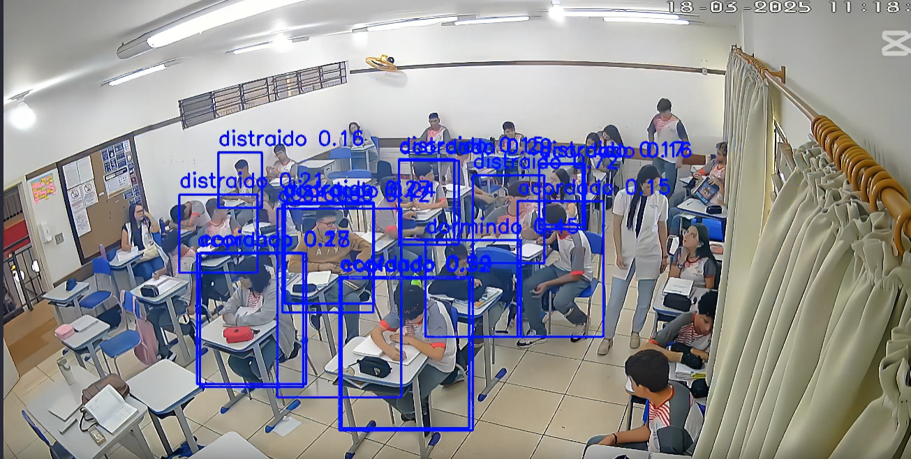
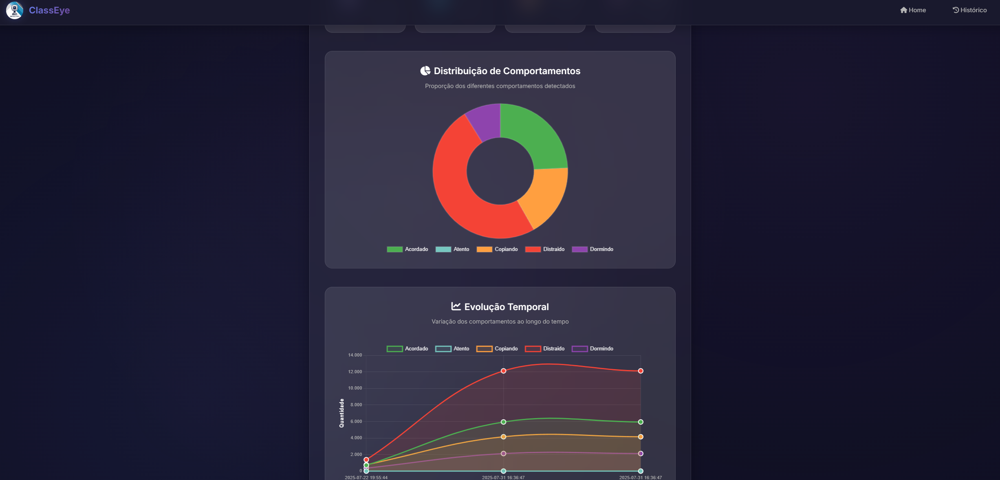
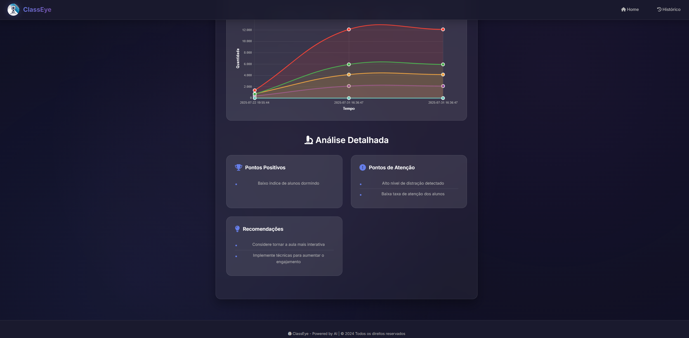

# 👁️ ClassEye — Plataforma Avançada de Monitoramento Educacional com IA

<p align="center">
  
</p>

<p align="center">
  
  
  
  
</p>

<p align="center">
  <strong>Sistema inteligente de visão computacional para análise comportamental em sala de aula</strong><br>
  Do treinamento do modelo à visualização pública de dados educacionais.
</p>

---

## 🎯 Visão Geral do Projeto

O **ClassEye** é uma plataforma completa de **monitoramento educacional baseado em Inteligência Artificial**, projetada para analisar **comportamentos coletivos em ambientes de ensino** por meio de visão computacional.

Diferente de sistemas tradicionais de vigilância, o ClassEye:

* ❌ Não identifica pessoas individualmente
* ✅ Trabalha apenas com **classes comportamentais**
* 📊 Gera **indicadores pedagógicos agregados**

O sistema foi desenvolvido com foco em **educação pública**, **ética em IA** e **apoio à tomada de decisão pedagógica**.

---

## 📸 Dashboard Público

<p align="center">
  
</p>
<p align="center">
  
</p>

O **Dashboard Público** apresenta:

* Gráficos de barras e pizza por comportamento
* Evolução temporal da atenção ao longo da aula
* Histórico de análises processadas
* Acesso a relatórios HTML individuais

---

## 🧠 Classes Comportamentais Detectadas

O modelo foi treinado para reconhecer **padrões visuais**, não indivíduos:

| Classe    | Descrição                                                     |
| --------- | ------------------------------------------------------------- |
| atento    | Aluno com postura e orientação visual compatíveis com atenção |
| distraido | Postura incompatível com foco na atividade                    |
| copiando  | Ação de escrita contínua em material físico                   |
| dormindo  | Cabeça apoiada ou postura de inatividade                      |
| acordado  | Presença ativa sem foco direto                                |

---

## 🧪 Processo de Treinamento do Modelo (YOLO)

### 1️⃣ Construção do Dataset

O treinamento do ClassEye utiliza um **dataset customizado**, criado especificamente para o contexto educacional:

* Imagens reais e simuladas de sala de aula
* Diversidade de ângulos, iluminação e posições
* Anotação manual por classe comportamental

Estrutura padrão YOLO:

```text
dataset/
├── images/
│   ├── train/
│   └── val/
├── labels/
│   ├── train/
│   └── val/
└── data.yaml
```

Cada anotação segue o formato:

```text
<class_id> <x_center> <y_center> <width> <height>
```

---

### 2️⃣ Treinamento com YOLOv8 (Ultralytics)

O modelo foi treinado utilizando **YOLOv8**, com pesos iniciais pré-treinados (*transfer learning*), acelerando a convergência.

Exemplo de comando de treino:

```bash
yolo detect train \
  data=data.yaml \
  model=yolov8n.pt \
  epochs=100 \
  imgsz=640 \
  batch=16
```

Principais estratégias adotadas:

* *Fine-tuning* em classes educacionais
* Ajuste de `confidence threshold`
* Avaliação por *precision*, *recall* e *mAP*

O melhor modelo é salvo automaticamente em:

```text
dataset/runs/detect/train2/weights/best.pt
```

---

### 3️⃣ Inferência Otimizada em Vídeo

Durante o processamento de vídeos:

* Frames são pulados (`frame_skip`) para reduzir custo computacional
* Inferência é feita com `conf` ajustável
* Bounding boxes são desenhadas apenas para feedback visual

Isso permite rodar o sistema em **máquinas sem GPU dedicada**, mantendo estabilidade.

---

## 🧩 Arquitetura Completa do Sistema

```text
Câmera / Vídeo
   │
   ▼
OpenCV (captura e pré-processamento)
   │
   ▼
YOLOv8 (detecção comportamental)
   │
   ├── Contagem por classe
   ├── Log CSV temporal
   ├── Vídeo anotado
   │
   ▼
Flask Backend
   │
   ├── API de progresso
   ├── Geração de gráficos
   └── Renderização HTML
   │
   ▼
Dashboard Público / Relatórios
```

---

## 📊 Geração de Relatórios

Para cada análise, o ClassEye gera automaticamente:

* 📄 Relatório HTML individual
* 📊 Gráfico de barras (frequência)
* 🥧 Gráfico de pizza (distribuição)
* 🎥 Vídeo processado com detecções
* 📁 Registro histórico

Todos os relatórios ficam disponíveis em:

```text
static/reports/
```

---

## 🧠 Backend Web (Flask)

Principais rotas:

| Rota            | Função                        |
| --------------- | ----------------------------- |
| `/`             | Página inicial                |
| `/upload`       | Upload de vídeo/imagem        |
| `/reports/<id>` | Relatório individual          |
| `/history`      | Histórico de análises         |
| `/graph-data`   | Dados dinâmicos para gráficos |
| `/progress`     | Progresso em tempo real       |

---

## 📂 Estrutura do Repositório

```text
ClassEye/
├── app.py
├── detect.py
├── utils.py
├── config.py
├── dataset/
│   └── runs/detect/train2/weights/best.pt
├── uploads/
├── processed/
├── static/
│   └── reports/
├── templates/
│   ├── index.html
│   ├── report.html
│   └── history.html
├── public_dashboard.png
├── aula.png
```

---

## ▶️ Execução do Projeto

```bash
pip install opencv-python torch ultralytics flask matplotlib pandas pillow numpy
python app.py
```

Acesse:

```text
http://127.0.0.1:5000
```

---

## 🎓 Aplicação Pedagógica e Institucional

O ClassEye pode ser utilizado para:

* Avaliação de engajamento em aulas
* Apoio a professores e coordenação
* Planejamento pedagógico baseado em dados
* Projetos de inovação educacional

> ⚠️ O sistema **não realiza reconhecimento facial** nem identificação pessoal.

---

## 📜 Licença 

Projeto educacional e científico.

Uso do mesmo, não permitido.

---

<p align="center"><strong>ClassEye — IA aplicada com responsabilidade à educação 📚🤖</strong></p>
